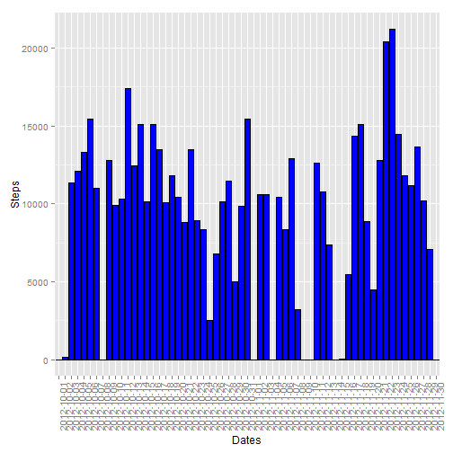
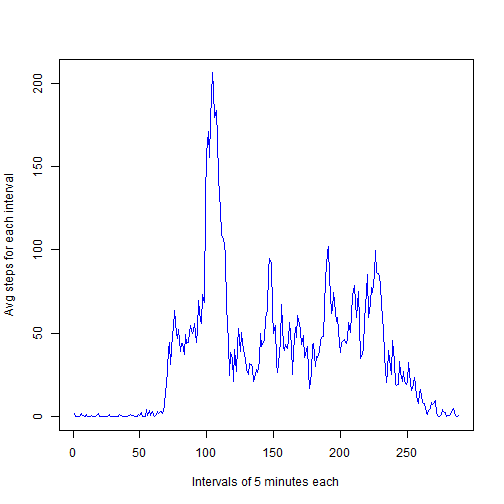
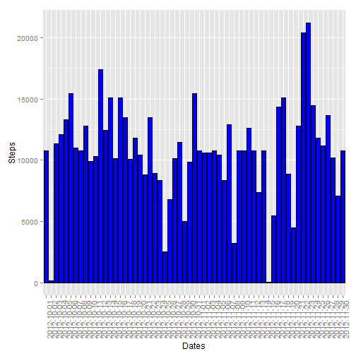
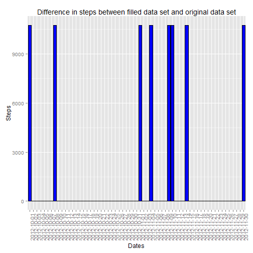

# Reproducible Research: Peer Assessment 1


## Loading and preprocessing the data

```r
data <- read.csv(unz("activity.zip", "activity.csv"))
```


## What is mean total number of steps taken per day?

```r
# Split the data in the different days and sum the steps
splitDays <- split(data, data$date)
stepsPerDay <- lapply(splitDays, function(x) sum(x$steps, na.rm=TRUE))
# Transform the resulting list in a vector
stepsPD <- unlist(stepsPerDay)

# Plot the steps in a histogram
library(ggplot2)
qplot(names(stepsPD), stepsPD, ylab="Steps", xlab="Dates", geom="histogram", stat="identity") + geom_bar(stat="identity", colour="black", fill="blue") + theme(axis.text.x = element_text(angle = 90, hjust = 1))
```

 

```r
# Calculate and report the mean and median total number of steps taken per day
mean(stepsPD)
```

```
## [1] 9354
```

```r
median(stepsPD)
```

```
## [1] 10395
```


## What is the average daily activity pattern?

```r
# Split the data in the different slots and calculate the average steps in those slots
splitIntervals <- split(data, data$interval)
avgStepsIntervals <- lapply(splitIntervals, function(x) mean(x$steps, na.rm=TRUE))
# Transform the resulting list in a vector
stepsPI <- unlist(avgStepsIntervals)

# Plot the steps in a time series
plot(stepsPI, type="l", ylab="Avg steps for each interval", xlab="Intervals of 5 minutes each", col="blue")
```

 

```r
# Report the interval with the max steps
names(stepsPI)[match(max(stepsPI),stepsPI)]
```

```
## [1] "835"
```


## Imputing missing values

```r
# Count the missing values
sum(is.na(data$steps))
```

```
## [1] 2304
```

```r
# Filling the missing values (NA) with the average daily pattern calculated above
fulldata <- data
for(i in 1:nrow(fulldata)) {
    if (is.na(fulldata$steps[i])) {
      fulldata$steps[i] <- stepsPI[match(fulldata$interval[i], names(stepsPI))]
    }
}

# Now we do the same steps we already did, but on the full data
# Split the data in the different days and sum the steps
splitFullDays <- split(fulldata, fulldata$date)
stepsPerFullDay <- lapply(splitFullDays, function(x) sum(x$steps, na.rm=TRUE))
# Transform the resulting list in a vector
stepsPFD <- unlist(stepsPerFullDay)

# Plot the steps in a histogram
library(ggplot2)
qplot(names(stepsPFD), stepsPFD, ylab="Steps", xlab="Dates", geom="histogram", stat="identity") + geom_bar(stat="identity", colour="black", fill="blue") + theme(axis.text.x = element_text(angle = 90, hjust = 1))
```

 

```r
# Calculate and report the mean and median total number of steps taken per day
mean(stepsPFD)
```

```
## [1] 10766
```

```r
median(stepsPFD)
```

```
## [1] 10766
```

```r
# Now we try to plot the difference of the means for the full days and the days with NA
diff <- stepsPFD - stepsPD
qplot(names(stepsPFD), diff, main="Difference in steps between filled data set and original data set", ylab="Steps", xlab="Dates", geom="histogram", stat="identity") + geom_bar(stat="identity", colour="black", fill="blue") + theme(axis.text.x = element_text(angle = 90, hjust = 1))
```

 

```r
# Calculating the number of days which are different in the two vectors
differentDays <- sum(diff!=0)
```

The difference is clearly visible in 8 days

## Are there differences in activity patterns between weekdays and weekends?

```r
# Add the factor variable for weekdays and weekends
# Note: "sabato" and "domenica" are in italian for "saturday" and "sunday"
fulldata$daytype <- ifelse(weekdays(as.Date(fulldata$date)) %in% c("sabato", "domenica"),"weekend", "weekday")

# Calculating mean for intervals
library(bear)
```

```
## Loading required package: reshape
## Loading required package: nlme
## Loading required package: gdata
## gdata: Unable to locate valid perl interpreter
## gdata: 
## gdata: read.xls() will be unable to read Excel XLS and XLSX files
## gdata: unless the 'perl=' argument is used to specify the location
## gdata: of a valid perl intrpreter.
## gdata: 
## gdata: (To avoid display of this message in the future, please
## gdata: ensure perl is installed and available on the executable
## gdata: search path.)
## gdata: Unable to load perl libaries needed by read.xls()
## gdata: to support 'XLX' (Excel 97-2004) files.
## 
## gdata: Unable to load perl libaries needed by read.xls()
## gdata: to support 'XLSX' (Excel 2007+) files.
## 
## gdata: Run the function 'installXLSXsupport()'
## gdata: to automatically download and install the perl
## gdata: libaries needed to support Excel XLS and XLSX formats.
## 
## Attaching package: 'gdata'
## 
## The following object is masked from 'package:stats':
## 
##     nobs
## 
## The following object is masked from 'package:utils':
## 
##     object.size
## 
## 
## ....................................
##                           
##    bear (BE/BA for R) 
##    v2.6.3
##    under license of GPL-2|GPL-3
##                                                                    
##    Please type 'go()' to run; or
##    'about.bear()' to read more.               
## 
## ....................................
```

```r
summarizedData <- summarySE(data=fulldata, measurevar="steps", groupvars=c("daytype", "interval"), na.rm=FALSE, conf.interval=.95)
```

```
## Loading required package: plyr
## 
## Attaching package: 'plyr'
## 
## The following objects are masked from 'package:reshape':
## 
##     rename, round_any
```

```r
#Plotting the two graps
ggplot(summarizedData, aes(x=interval, y=steps)) + geom_line() + facet_grid(daytype ~ .)
```

 
